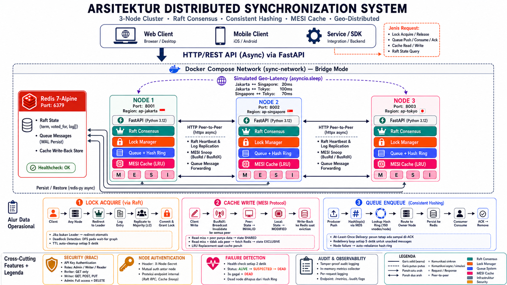

# Distributed Synchronization System

> **Tugas 3 — Sistem Parallel dan Terdistribusi**
> Implementasi sistem sinkronisasi terdistribusi yang mensimulasikan skenario real-world distributed computing: leader election, message routing, dan cache consistency di atas kluster 3-node.

**Algoritma inti:** Raft Consensus · Consistent Hashing · MESI Cache Coherence Protocol

---

### Pengumpulan

| Item | Link |
|---|---|
| Video YouTube | [https://youtu.be/VJmHzKOrkEc](https://youtu.be/VJmHzKOrkEc) |
| Repository | [github.com/mshadiqaf/distributed-sync-system](https://github.com/mshadiqaf/distributed-sync-system) |

### Identitas

| Identitas | Detail |
|---|---|
| **Nama** | Muhammad Shadiq Al-Fatiy |
| **NIM** | 11231065 |
| **Kelas** | Sistem Paralel dan Terdistribusi A (SisTer A) |
| **Prodi / Jurusan** | Informatika — JTEIB |
| **Fakultas** | Sains dan Teknologi Informasi (FSTI) |

---

## Daftar Isi

1. [Gambaran Arsitektur](#1-gambaran-arsitektur)
2. [Komponen Sistem](#2-komponen-sistem)
3. [Tech Stack](#3-tech-stack)
4. [Struktur Proyek](#4-struktur-proyek)
5. [Panduan Menjalankan](#5-panduan-menjalankan)
6. [API Reference](#6-api-reference)
7. [Testing](#7-testing)
8. [Benchmarking](#8-benchmarking)
9. [Fitur Bonus](#9-fitur-bonus)
10. [Environment Variables](#10-environment-variables)
11. [Troubleshooting](#11-troubleshooting)
12. [Referensi Pustaka](#12-referensi-pustaka)

---

## 1. Gambaran Arsitektur

Tiga node identik berjalan di dalam Docker Compose network, masing-masing menjalankan FastAPI server yang memuat seluruh subsistem secara simultan. Redis berperan sebagai shared persistent store.



---

## 2. Komponen Sistem

### 2.1 Distributed Lock Manager — Raft Consensus

Seluruh operasi lock dikoordinasikan melalui algoritma Raft yang diimplementasikan dari nol.

| Aspek | Detail |
|---|---|
| Election Timeout | 1500–3000 ms (randomized) |
| Heartbeat Interval | 500 ms |
| Jenis Lock | **Exclusive** (satu client) dan **Shared** (multi-reader) |
| Deadlock Detection | DFS pada wait-for graph |
| Auto-Cleanup | TTL-based, background task setiap 5 detik |
| Fault Tolerance | Leader mati → election otomatis, kluster pulih dalam milidetik |

**Alur singkat:** Client → Leader → Log Entry → Replicate ke mayoritas (≥2/3) → Commit → Grant Lock

### 2.2 Distributed Queue — Consistent Hashing

Antrean pesan berbasis topik yang didistribusikan menggunakan hash ring.

| Aspek | Detail |
|---|---|
| Hash Function | MD5 |
| Virtual Nodes | 150 per node fisik |
| Delivery Guarantee | At-least-once |
| Persistence | Redis (pesan tetap aman saat node restart) |
| Redelivery | Background loop setiap 5 detik untuk unacked messages |

**Alur singkat:** Producer → hash(topic) → lookup ring → route ke owner node → persist Redis → Consumer poll → ACK → remove

### 2.3 Cache Coherence — MESI Protocol

Cache terdistribusi dengan konsistensi antar node menggunakan bus snooping via HTTP.

| State | Keterangan |
|---|---|
| **M** (Modified) | Data diubah secara lokal, satu-satunya salinan valid |
| **E** (Exclusive) | Data bersih, hanya ada di cache node ini |
| **S** (Shared) | Data bersih, bisa ada di cache node lain |
| **I** (Invalid) | Data tidak valid / tidak ada |

- **Write:** broadcast `BusRdX` (invalidate) ke semua peer → local state → `M`
- **Read miss + peer punya:** `BusRd` → insert sebagai `S`
- **Read miss + tidak ada peer:** fetch Redis → insert sebagai `E`
- **Eviction:** LRU policy, entry `M` di-flush ke Redis sebelum dibuang

### 2.4 Containerization — Docker

- Satu `Dockerfile` untuk semua node, dikonfigurasi via environment variables
- Docker Compose mengatur orkestrasi 3-node + Redis dengan health check
- Environment configuration via `.env` files

---

## 3. Tech Stack

| Layer | Teknologi |
|---|---|
| Bahasa | Python 3.12+ |
| Web Framework | FastAPI (fully async) |
| Persistent Store | Redis 7-Alpine |
| Inter-node HTTP | httpx (async, retry + exponential backoff) |
| Containerization | Docker & Docker Compose |
| Unit Testing | pytest, pytest-asyncio |
| Load Testing | Locust |
| Grafik Benchmark | matplotlib |

---

## 4. Struktur Proyek

```
distributed-sync-system/
├── src/
│   ├── main.py                     # Entry point + geo-latency middleware
│   ├── nodes/
│   │   ├── base_node.py            # FastAPI app factory & semua route
│   │   ├── lock_manager.py         # Distributed lock state machine
│   │   ├── queue_node.py           # Queue + Consistent Hash Ring
│   │   └── cache_node.py           # MESI cache coherence
│   ├── consensus/
│   │   └── raft.py                 # Raft (election + log replication)
│   ├── communication/
│   │   ├── message_passing.py      # HTTP client antar-node
│   │   └── failure_detector.py     # Heartbeat-based failure detection
│   ├── geo/
│   │   └── latency.py              # Simulated latency matrix
│   └── utils/
│       ├── config.py               # Pydantic settings
│       ├── metrics.py              # In-memory metrics
│       └── security.py             # RBAC + audit logging
├── tests/
│   ├── unit/                       # 63 unit tests (tanpa kluster)
│   └── integration/                # Integration test (butuh kluster berjalan)
├── docs/
│   ├── architecture.md             # Penjelasan arsitektur + diagram protokol
│   ├── api_spec.md                 # Spesifikasi API + contoh request/response
│   ├── api_spec.yaml               # OpenAPI 3.0 Specification (Swagger/Postman)
│   └── deployment_guide.md         # Panduan deployment + troubleshooting
├── docker/
│   ├── Dockerfile.node             # Image Docker untuk satu node
│   └── docker-compose.yml          # Orkestrasi 3-node + Redis
├── benchmarks/
│   ├── benchmark_runner.py         # Suite benchmark performa otomatis
│   └── visualize.py                # Generator grafik matplotlib
├── requirements.txt                # Dependensi Python
├── pytest.ini                      # Konfigurasi pytest
├── .env.example                    # Template environment variables
└── README.md                       # Dokumentasi utama (file ini)
```

---

## 5. Panduan Menjalankan

### Prasyarat

- [Docker Desktop](https://www.docker.com/products/docker-desktop/) v20+ (termasuk Compose)
- [Python 3.12+](https://www.python.org/downloads/) — hanya jika ingin jalankan lokal tanpa Docker

### Opsi A — Docker Compose (direkomendasikan)

```bash
# Clone
git clone https://github.com/mshadiqaf/distributed-sync-system.git
cd distributed-sync-system

# Bangun & jalankan kluster
docker-compose -f docker/docker-compose.yml up --build -d

# Cek health semua node
curl http://localhost:8001/health
curl http://localhost:8002/health
curl http://localhost:8003/health
```

Tunggu 3–5 detik agar Raft election selesai. Node Leader akan menampilkan `"role": "leader"` di respons `/health`.

```bash
# Matikan kluster
docker-compose -f docker/docker-compose.yml down

# Matikan + hapus data Redis
docker-compose -f docker/docker-compose.yml down -v
```

### Opsi B — Lokal (tanpa Docker)

```bash
pip install -r requirements.txt

# Jalankan Redis terlebih dahulu
docker run -d --name redis -p 6379:6379 redis:7-alpine
```

Buka 3 terminal terpisah:

**Terminal 1 — Node 1 (Jakarta)**
```bash
NODE_ID=node1 NODE_PORT=8001 NODE_REGION=ap-jakarta \
PEER_NODES=http://localhost:8002,http://localhost:8003 \
API_KEY=dev-api-key-123 ADMIN_KEY=dev-admin-key-456 NODE_SECRET=dev-node-secret-789 \
python -m uvicorn src.main:app --host 0.0.0.0 --port 8001
```

**Terminal 2 — Node 2 (Singapore)**
```bash
NODE_ID=node2 NODE_PORT=8002 NODE_REGION=ap-singapore \
PEER_NODES=http://localhost:8001,http://localhost:8003 \
API_KEY=dev-api-key-123 ADMIN_KEY=dev-admin-key-456 NODE_SECRET=dev-node-secret-789 \
python -m uvicorn src.main:app --host 0.0.0.0 --port 8002
```

**Terminal 3 — Node 3 (Tokyo)**
```bash
NODE_ID=node3 NODE_PORT=8003 NODE_REGION=ap-tokyo \
PEER_NODES=http://localhost:8001,http://localhost:8002 \
API_KEY=dev-api-key-123 ADMIN_KEY=dev-admin-key-456 NODE_SECRET=dev-node-secret-789 \
python -m uvicorn src.main:app --host 0.0.0.0 --port 8003
```

---

## 6. API Reference

Swagger UI tersedia di `http://localhost:800X/docs` (tanpa autentikasi).

### Autentikasi

Header `X-API-Key` diperlukan untuk semua endpoint kecuali `/health` dan `/docs`.

| Key | Role | Akses |
|---|---|---|
| `dev-api-key-123` | Writer | GET, POST, PUT |
| `dev-admin-key-456` | Admin | Semua method termasuk DELETE |

### Endpoint

<details>
<summary><strong>System</strong></summary>

| Method | Path | Deskripsi |
|---|---|---|
| GET | `/health` | Status node + role Raft |
| GET | `/peers` | Daftar peer |
| GET | `/metrics` | Metrik performa |
| GET | `/cluster/status` | Status kluster |

</details>

<details>
<summary><strong>Raft Consensus</strong></summary>

| Method | Path | Deskripsi |
|---|---|---|
| GET | `/raft/state` | Role, term, leader saat ini |
| POST | `/raft/request-vote` | RPC pemilihan (internal) |
| POST | `/raft/append-entries` | RPC heartbeat + replikasi (internal) |

</details>

<details>
<summary><strong>Distributed Lock</strong> — harus dikirim ke node Leader</summary>

| Method | Path | Deskripsi |
|---|---|---|
| POST | `/lock/acquire` | Akuisisi kunci |
| POST | `/lock/release` | Lepas kunci |
| GET | `/lock/status` | Kunci aktif & waiting |
| GET | `/lock/deadlocks` | Wait-for graph |

</details>

<details>
<summary><strong>Distributed Queue</strong> — auto-route via Consistent Hashing</summary>

| Method | Path | Deskripsi |
|---|---|---|
| POST | `/queue/push` | Kirim pesan ke topik |
| POST | `/queue/consume` | Ambil pesan |
| POST | `/queue/ack` | Konfirmasi pesan diproses |
| GET | `/queue/status` | Kedalaman antrean |
| GET | `/queue/ring` | Visualisasi hash ring |

</details>

<details>
<summary><strong>Cache (MESI)</strong></summary>

| Method | Path | Deskripsi |
|---|---|---|
| GET | `/cache/{key}` | Baca (MESI protocol) |
| PUT | `/cache/{key}` | Tulis (MESI protocol) |
| DELETE | `/cache/{key}` | Invalidasi |
| GET | `/cache-stats` | State distribution + statistik |
| GET | `/cache-entries` | Semua entry beserta state |

</details>

<details>
<summary><strong>Security</strong></summary>

| Method | Path | Deskripsi |
|---|---|---|
| GET | `/audit/logs` | Riwayat akses (admin only) |

</details>

### Contoh

**Lock — Acquire Exclusive:**
```bash
curl -X POST http://localhost:8001/lock/acquire \
  -H "X-API-Key: dev-api-key-123" -H "Content-Type: application/json" \
  -d '{"resource": "file.db", "client_id": "app1", "lock_type": "exclusive", "ttl": 30}'
```
```json
{"status": "granted", "resource": "file.db", "client_id": "app1", "lock_type": "exclusive"}
```

**Queue — Push:**
```bash
curl -X POST http://localhost:8001/queue/push \
  -H "X-API-Key: dev-api-key-123" -H "Content-Type: application/json" \
  -d '{"topic": "orders", "data": {"order_id": 101, "item": "laptop"}, "producer_id": "shop"}'
```
```json
{"status": "queued", "message_id": "a1b2c3d4", "topic": "orders", "node": "node2"}
```

**Cache — Write lalu Read dari node lain:**
```bash
# Node 1: write → state M
curl -X PUT http://localhost:8001/cache/user:42 \
  -H "X-API-Key: dev-api-key-123" -H "Content-Type: application/json" \
  -d '{"value": "John Doe"}'

# Node 2: read → BusRd → state S
curl -H "X-API-Key: dev-api-key-123" http://localhost:8002/cache/user:42
```

---

## 7. Testing

### Unit Test (tanpa kluster)

```bash
pip install -r requirements.txt
python -m pytest tests/unit/ -v
```

Hasil:

```
tests/unit/test_cache.py          21 passed
tests/unit/test_lock_manager.py   17 passed
tests/unit/test_metrics.py         5 passed
tests/unit/test_queue.py          20 passed

======================== 63 passed in 1.60s ========================
```

| File | Tests | Cakupan |
|---|---|---|
| `test_lock_manager.py` | 17 | Shared/exclusive, deadlock, TTL, Raft |
| `test_queue.py` | 20 | Push/consume/ack, hash ring, redelivery |
| `test_cache.py` | 21 | Transisi MESI (M↔E↔S↔I), LRU, write-back |
| `test_metrics.py` | 5 | Counter, reset |
| **Total** | **63** | |

### Integration Test (butuh kluster)

```bash
# Pastikan docker-compose up sudah berjalan
python -m pytest tests/integration/ -v
```

---

## 8. Benchmarking

**Metode 1 — Static benchmark + grafik matplotlib:**
```bash
python benchmarks/benchmark_runner.py   # hasil → benchmarks/results/
python benchmarks/visualize.py          # grafik → benchmarks/graphs/
```

**Metode 2 — Locust (real-time load test):**
```bash
pip install locust
locust -f benchmarks/locustfile.py
# Buka http://localhost:8089
# Host: http://localhost:8001 | Users: 100 | Ramp up: 10/s
```

> Lonjakan response time saat Raft election berlangsung adalah perilaku normal — menunjukkan mekanisme self-healing bekerja.

---

## 9. Fitur Bonus

### Geo-Distributed Multi-Region

Simulasi latensi jaringan antar 3 region Asia menggunakan middleware `asyncio.sleep()` + header `X-Source-Region`:

| Node | Region | Latensi ke Jakarta | Latensi ke Singapore | Latensi ke Tokyo |
|---|---|---|---|---|
| Node 1 (:8001) | ap-jakarta | 2ms | 20ms | 100ms |
| Node 2 (:8002) | ap-singapore | 20ms | 2ms | 70ms |
| Node 3 (:8003) | ap-tokyo | 100ms | 70ms | 2ms |

### Security & RBAC

- API Key authentication pada setiap request client (`X-API-Key`)
- Tiga role: **Admin** (full access), **Writer** (read + write), **Reader** (read-only)
- Komunikasi internal terproteksi via `X-Node-Secret`
- Audit logging tersedia di `/audit/logs` (admin only)

---

## 10. Environment Variables

Lihat `.env.example` untuk template. Variabel utama:

| Variabel | Default | Fungsi |
|---|---|---|
| `NODE_ID` | — | ID unik node |
| `NODE_PORT` | `8001` | Port HTTP |
| `NODE_REGION` | — | Region simulasi geo-distributed |
| `PEER_NODES` | — | URL peer (dipisah koma) |
| `REDIS_URL` | `redis://localhost:6379/0` | Koneksi Redis |
| `API_KEY` | `dev-api-key-123` | Key role writer |
| `ADMIN_KEY` | `dev-admin-key-456` | Key role admin |
| `NODE_SECRET` | `dev-node-secret-789` | Auth antar node |
| `ELECTION_TIMEOUT_MIN` | `1500` | Min Raft election (ms) |
| `ELECTION_TIMEOUT_MAX` | `3000` | Max Raft election (ms) |
| `HEARTBEAT_INTERVAL` | `500` | Heartbeat leader (ms) |
| `CACHE_MAX_SIZE` | `1000` | Kapasitas cache per node |

---

## 11. Troubleshooting

| Gejala | Solusi |
|---|---|
| Node tidak merespons | Cek log: `docker-compose -f docker/docker-compose.yml logs node1` |
| Leader belum terpilih | Tunggu 3–5 detik. Verifikasi: `curl localhost:8001/raft/state` |
| Lock ditolak (`not_leader`) | Kirim request ke node Leader. Cari via `/raft/state` |
| Redis connection error | Pastikan container Redis aktif: `docker ps \| grep redis` |

Panduan lengkap → [docs/deployment_guide.md](docs/deployment_guide.md)

---

## 12. Referensi Pustaka

1. Ongaro, D. & Ousterhout, J. (2014). [In Search of an Understandable Consensus Algorithm (Raft)](https://raft.github.io/raft.pdf).
2. Karger, D. et al. (1997). [Consistent Hashing and Random Trees](https://en.wikipedia.org/wiki/Consistent_hashing).
3. Papamarcos, M. & Patel, J. (1984). [A Low-Overhead Coherence Solution (MESI Protocol)](https://en.wikipedia.org/wiki/MESI_protocol).
4. Kleppmann, M. (2017). *Designing Data-Intensive Applications*. O'Reilly Media.
5. [FastAPI Documentation](https://fastapi.tiangolo.com/) · [Redis Documentation](https://redis.io/docs/)

---

### Dokumentasi Teknis Tambahan

- [docs/architecture.md](docs/architecture.md) — Arsitektur lengkap + diagram protokol
- [docs/api_spec.md](docs/api_spec.md) — Spesifikasi API + contoh request/response
- [docs/api_spec.yaml](docs/api_spec.yaml) — OpenAPI 3.0 (Swagger/Postman)
- [docs/deployment_guide.md](docs/deployment_guide.md) — Panduan deploy + troubleshooting
